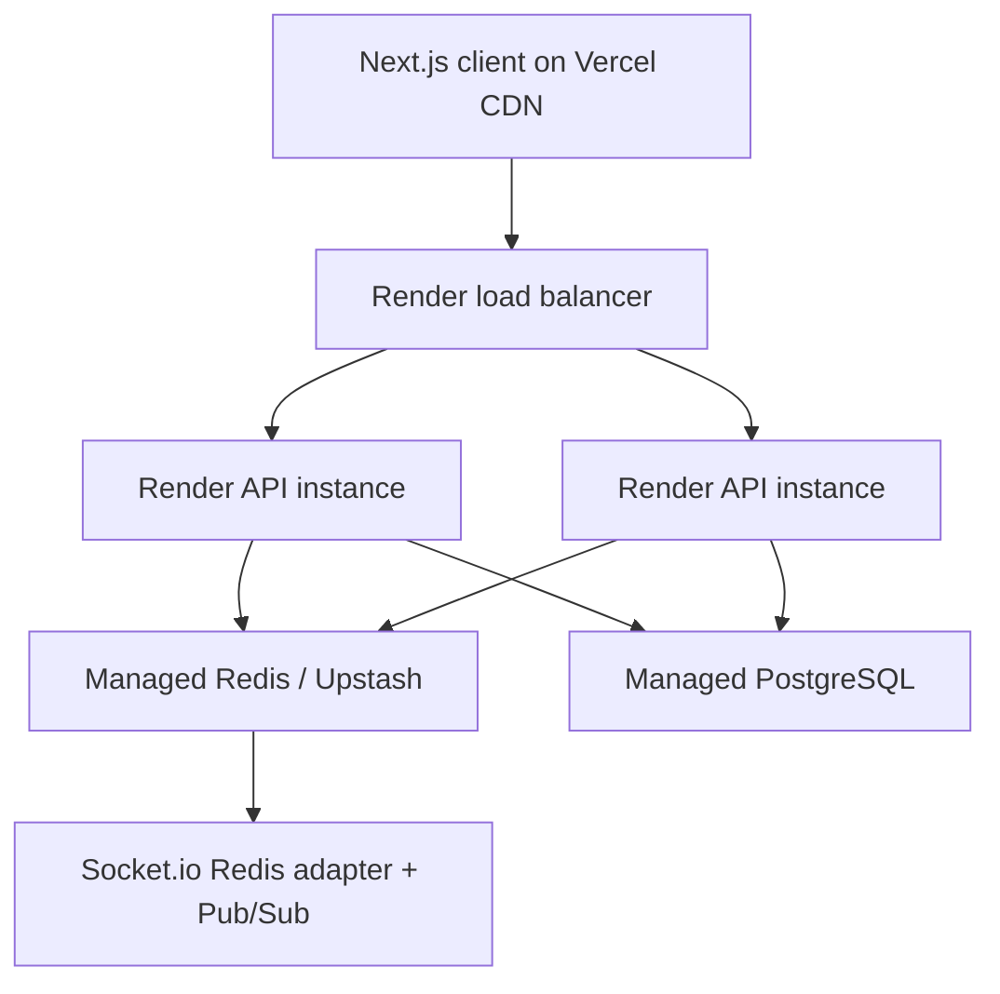

# Production Deployment Runbook

This runbook covers Step 8 only: deployment, scaling, and reliability for the virtual coin prediction platform.

## Architecture



PostgreSQL is the source of truth. Redis is used for Socket.io fanout, short-lived state snapshots, rate limiting support, and the game engine distributed lock.

## Installation Commands

```bash
npm ci
npm run lint
npm run typecheck
npm run build
docker compose up --build
```

The backend health endpoint is available at `http://localhost:4000/health`.

## Required Environment Variables

Backend:

```bash
DATABASE_URL=postgresql://...
REDIS_URL=redis://...
JWT_ACCESS_SECRET=replace-with-32-plus-character-access-secret
JWT_REFRESH_SECRET=replace-with-different-32-plus-character-refresh-secret
COOKIE_SECRET=replace-with-different-32-plus-character-cookie-secret
CLIENT_URL=https://your-client.vercel.app
CLIENT_ORIGIN=https://your-client.vercel.app
ALLOWED_ORIGINS=https://your-client.vercel.app
SOCKET_CORS_ORIGIN=https://your-client.vercel.app
SOCKET_ALLOWED_ORIGINS=https://your-client.vercel.app
GAME_ENGINE_ENABLED=true
```

Production startup fails if PostgreSQL, Redis, JWT secrets, `COOKIE_SECRET`, or
configured origins are missing. `JWT_ACCESS_SECRET` and `JWT_REFRESH_SECRET`
must be different values.

Frontend:

```bash
NEXT_PUBLIC_API_URL=https://your-api.onrender.com
NEXT_PUBLIC_API_BASE_PATH=/api/v1
NEXT_PUBLIC_SOCKET_URL=https://your-api.onrender.com
```

Use separate Vercel and Render environment groups for development, staging, and production. Never commit real secrets.

## Render Backend Deployment

1. Push this repository to GitHub, GitLab, or Bitbucket.
2. In Render, create a Blueprint from `render.yaml`.
3. Set the `sync: false` secrets in the dashboard:
   `DATABASE_URL`, `REDIS_URL`, `JWT_ACCESS_SECRET`, `JWT_REFRESH_SECRET`,
   `COOKIE_SECRET`, `CLIENT_URL`, `CLIENT_ORIGIN`, `ALLOWED_ORIGINS`,
   `SOCKET_CORS_ORIGIN`, `SOCKET_ALLOWED_ORIGINS`.
4. Create a deploy hook for `color-trading-api`.
5. Save the hook as GitHub secret `RENDER_DEPLOY_HOOK_URL`.
6. Push to `main`; GitHub Actions verifies the app and triggers Render.

Render service settings:

- Runtime: Docker
- Dockerfile: `apps/server/Dockerfile`
- Health check: `/health`
- Minimum instances for production: `2`
- Game engine: leave `GAME_ENGINE_ENABLED=true`; Redis `SET NX` lock ensures only one scheduler acts.

## Vercel Frontend Deployment

Use Vercel Git integration for the frontend.

- Project root: `apps/client`
- Install command: `npm ci`
- Build command: `npm run build`
- Output: Next.js default
- Production env:
  `NEXT_PUBLIC_API_URL`, `NEXT_PUBLIC_API_BASE_PATH=/api/v1`,
  `NEXT_PUBLIC_SOCKET_URL`

Preview deployments should point to a staging Render backend. Production deployments should point to the production Render API.

## Redis and Socket.io Hardening

The Socket.io server is configured for:

- JWT socket authentication
- Redis adapter for cross-instance fanout
- Redis Pub/Sub event bus
- `pingInterval`/`pingTimeout` heartbeat detection
- connection state recovery
- reconnect `state:sync` snapshots
- per-socket event rate limiting
- user rooms: `user:{userId}`
- round rooms: `round:{roundId}`

Redis keys:

- `current_round`
- `round:{id}:state`
- `user:{id}:wallet_cache`
- `game:round-engine:lock`

## Scaling to 10k Concurrent Users

Scale the backend horizontally behind Render's load balancer. Each API instance remains stateless; session identity comes from JWT + PostgreSQL session validation. Socket messages are propagated through Redis adapter/PubSub, so users connected to different instances receive the same round and wallet events.

Use at least:

- 2+ backend instances
- managed PostgreSQL with connection limits sized for peak API concurrency
- managed Redis in the same region as Render
- CDN-backed Vercel frontend
- short socket payloads and room-targeted emits

For wallet and bets, correctness is protected by PostgreSQL transactions, serializable wallet updates, unique idempotency keys, and unique `(user_id, round_id)` betting constraints.

## Failure Recovery Strategy

- API instance crash: Render restarts the container; clients reconnect and call `state:sync`.
- Socket event missed: client reconnect/resync pulls the latest current round and wallet snapshot from PostgreSQL.
- Duplicate game engine tick: Redis `SET NX PX` lock allows only one active lifecycle runner.
- Duplicate bet or ledger operation: database unique constraints and idempotency keys turn retries into safe replays.
- Ledger write failure: retry the original operation with the same idempotency key. Do not mint a new key for the same user action.
- Redis outage: critical transaction state remains in PostgreSQL; realtime fanout degrades until Redis recovers.
- Postgres outage: reject critical writes and keep the health endpoint dependency status visible for alerting.

## Monitoring and Logging

The server emits structured logs in production for:

- HTTP request access logs
- unhandled request errors
- socket connect/disconnect
- Redis adapter and realtime event bus status
- game event publication
- wallet ledger success, failure, and idempotent replay

Recommended production additions:

- Sentry or equivalent error tracking
- Render log stream to your observability system
- alerts on `/health` failure
- alerts on elevated 5xx rate
- alerts on wallet ledger failures and duplicate idempotency conflicts
- dashboards for socket connection count, Redis latency, DB latency, and round completion time

## Production Checklist

- [ ] Real production secrets set in Render and Vercel
- [ ] `DATABASE_URL` points to managed PostgreSQL
- [ ] `REDIS_URL` points to managed Redis or Upstash
- [ ] `JWT_ACCESS_SECRET`, `JWT_REFRESH_SECRET`, and `COOKIE_SECRET` are unique non-placeholder values
- [ ] `ALLOWED_ORIGINS` and `SOCKET_ALLOWED_ORIGINS` equal the production Vercel URL
- [ ] `SOCKET_CORS_ORIGIN` equals the production Vercel URL
- [ ] `NEXT_PUBLIC_API_URL` and `NEXT_PUBLIC_SOCKET_URL` point to Render
- [ ] PostgreSQL schema migration process defined before first launch
- [ ] Render health check passes on `/health`
- [ ] Minimum 2 backend instances configured
- [ ] Game engine lock verified with multi-instance deployment
- [ ] CI/CD GitHub secret `RENDER_DEPLOY_HOOK_URL` configured
- [ ] Vercel Git integration connected to `apps/client`
- [ ] Error/log drains configured
- [ ] Load test completed for socket connections and bet placement
